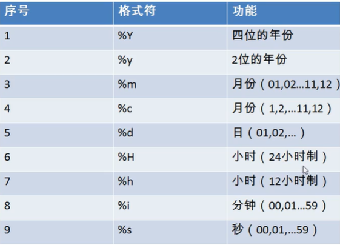

###常见函数


length,concat前面说过了

1.大小写 upper lower

SELECT UPPER('asdf');

2.substr 注意sql索引从1开始

SELECT SUBSTR('abcdefg', 2)  out_put;

第三个数是从索引开始的长度
SELECT SUBSTR('abcdefg', 1，3)  out_put;


案例：姓名首字符大写
```
SELECT CONCAT(UPPER(SUBSTR(lastname,1,1)),SUBSTR(lastname,2), '_',first_name)
```

3. INSTR 判断前面字符串含有后面字符串的位置,找不到返回0

SELECT INSTR('ABCDEFG','CD') AS out_put;

4. trim 去空格

SELECT TRIM('   JIJI   ') AS out_put;

SELECT TRIM('a' FROM 'aaa张aa在aa')

5. LPAD 左填充，总共的位数，RPAD右填充，如果给出的数字太小就会截断

`SELECT LPAD('ABC', 10, '*') AS out_put`

6. replace 替换

SELECT REPLACE('abdcefg', 'ce', '!!')

####数学函数

1.round 取整

select round(1.65)

select round(1.56, 1)

2.ceil 向上取整

select seil(1.02);


3.floor向下取整

select floor(2.6)

4.truncate 截断

select truncate(1.65, 1);

5.mod取余

select mod(-10, 3)

#### 日期函数

1.now 显示当前时间

select now();

2.curdate 返回当前日期

select curdate();

3.curtime 当前时间

select curtime();

4.显示特定单位

可以用 year month monthname等待

select year(hiredate) 年 from employees

5.str_to_date 日期字符串转换成日期



select str_to_date('1996-6-8','%Y-%c-%d')

查询入职日期是1992-4-3的员工,往往前端给过来的查询都是字符串，因此需要转

SELECT * FROM employees WHERE hiredate = STR_TO_DATE('4-3 1992', '%c-%d %Y')

6.DATE_FORMAT 日期转字符

select date_format(now(), '%Y年%m月%d日')

查询有奖金的员工名字和入职日期

SELECT first_name, DATE_FORMAT(hiredate, '%Y年%c月%d日') FROM employees WHERE commission_pct IS NOT NULL

####其他函数
select version()

select database()

select user()

####流程控制函数

1.if函数

select if(3>2,'big','small')

2.case使用1

case 要判断的字段或者表达式 when 常量 then 语句  else  语句  end

查询员工工资，如果部门号30 1.1倍工资 40 1.2倍工资 其他工资不变

```
SELECT salary 原始工资,department_id,
CASE department_id
WHEN 30 THEN salary*1.1
WHEN 40 THEN salary*1.2
ELSE salary
END AS 新工资
FROM employees;
```
3.case使用2

case
when 条件 then 执行
when 条件 then 执行
else 执行
end

查询工资，如果大于2w 显示挣得多，1.5w以上显示还行 其他太次
```
SELECT salary,
CASE
WHEN salary>20000 THEN 'rich'
WHEN salary>15000 THEN 'alright'
ELSE 'poor'
END AS 评论
FROM employees
```
####分组函数

1 sum avg max

运算都是忽略null的

2 和distinct混用

3 count

`select count(*) from employees`

select count(1) from employees; 统计个数

INNODB引擎下 count(星) 和 count(1)效率差不多
